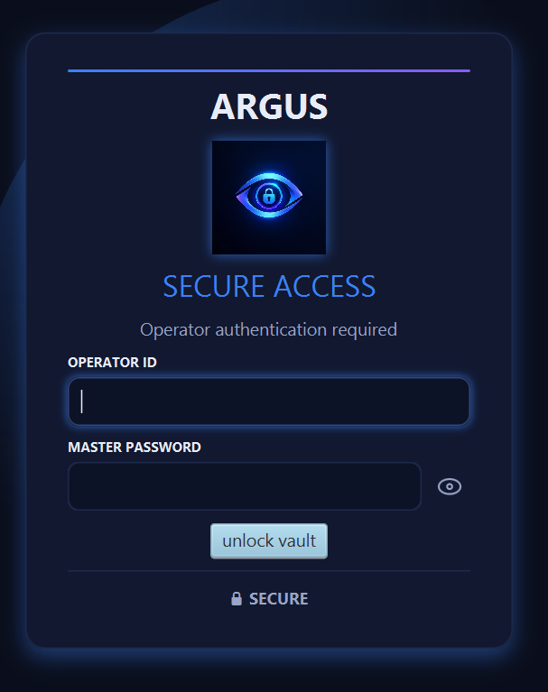
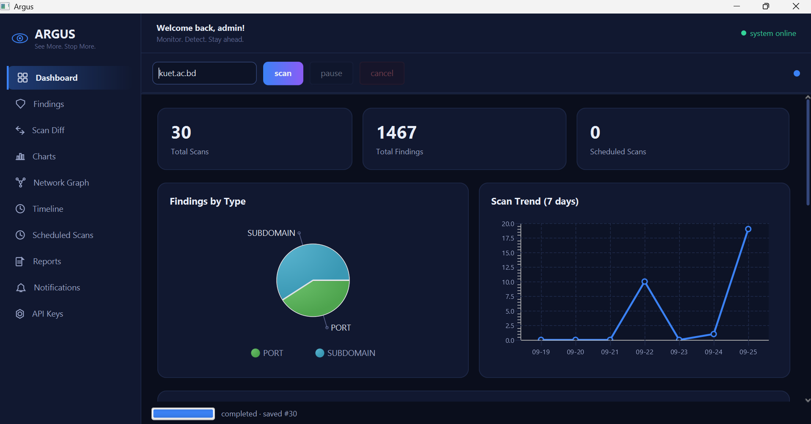
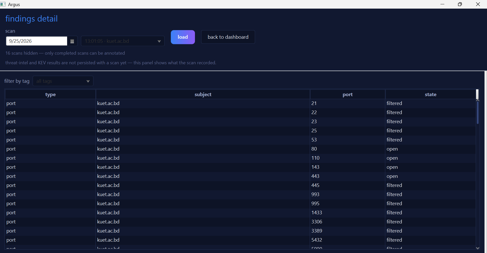
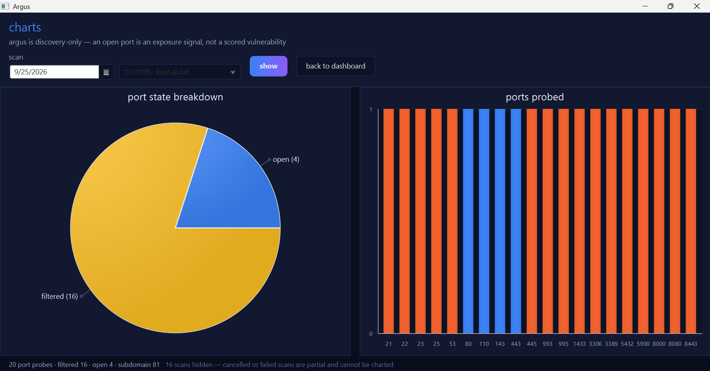
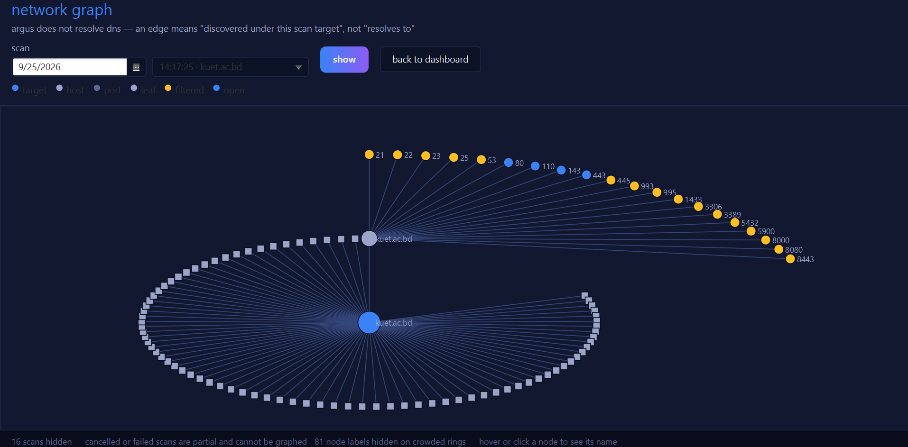
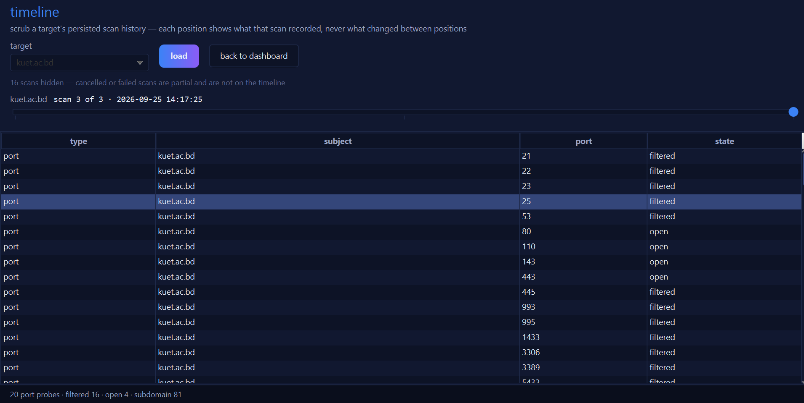
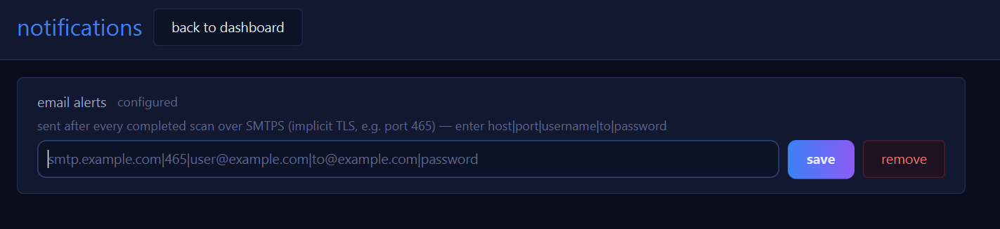
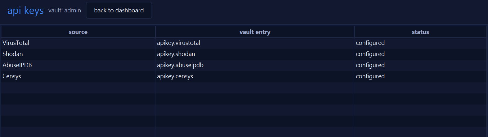

# Argus

## Project Overview

Argus is a JavaFX desktop application for Attack Surface Management (ASM) during the
reconnaissance phase of an authorized security assessment. Given a target domain, it
discovers subdomains and probes a fixed set of common TCP ports, stores every scan in a
local SQLite database, and lets the operator review, compare, chart, and export the results.
After each saved scan it can also query threat-intelligence sources and check the CISA Known
Exploited Vulnerabilities (KEV) catalog.

Argus is discovery-only. It performs no exploitation, brute-forcing, or other attack
activity: a port probe is a single TCP connection attempt, and subdomain discovery reads
public Certificate Transparency data.

What Argus discovers and records:

- **Open ports and services exposure.** TCP connect probes against a fixed list of 20 common
  ports, each recorded as `open`, `closed`, or `filtered`.
- **Subdomains.** Names found in Certificate Transparency logs through crt.name.
- **Scan findings over time.** Every completed scan is persisted so scans can be compared
  and browsed later.
- **Threat-intelligence context.** VirusTotal and Censys lookups for the scan target, and a
  match against the CISA KEV catalog (see [Threat Intelligence](#threat-intelligence-apis)
  for the current scope).

## Table of Contents

- [Key Features](#key-features)
- [Application Preview](#application-preview)
- [Architecture](#architecture)
- [Scan Workflow](#scan-workflow)
- [Threat Intelligence APIs](#threat-intelligence-apis)
- [Scan Comparison](#scan-comparison)
- [Notifications](#notifications)
- [Reports and Export](#reports-and-export)
- [Scheduled and Recurring Scans](#scheduled-and-recurring-scans)
- [Technology Stack](#technology-stack)
- [Project Structure](#project-structure)
- [Requirements](#requirements)
- [Installation and Setup](#installation-and-setup)
- [Configuration](#configuration)
- [Running Argus](#running-argus)
- [Testing](#testing)
- [Security and Data Storage](#security-and-data-storage)
- [Project Status](#project-status)
- [License](#license)
- [Disclaimer](#disclaimer)

## Key Features

### Attack Surface Discovery

- **Port scanning.** Multithreaded TCP connect scan of 20 common ports (21, 22, 23, 25, 53,
  80, 110, 143, 443, 445, 993, 995, 1433, 3306, 3389, 5432, 5900, 8000, 8080, 8443) built on
  a fixed thread pool. The port list is fixed; there is no port-selection field in the UI.
- **Subdomain enumeration.** Queries crt.name for Certificate Transparency entries under
  the target's registrable domain, then normalizes, de-duplicates, and scopes the names to
  the target. No API key is required. An HTTP error or malformed response is reported as a
  failure and is not silently replaced by another source.
- **Producer-consumer scan pipeline.** Scan jobs publish findings to a shared queue that is
  implemented with `synchronized`, `wait()`, and `notifyAll()`. The subdomain and port jobs
  run concurrently under a scan coordinator.
- **Live scan controls.** Progress bar, per-worker status list, and a log console on the
  dashboard, with pause, resume, and cancel.
- **Multiple targets.** A target queue accepts domains dropped onto the dashboard, either as
  text or as a text file, and runs them one after another.

### Threat Intelligence

After a scan is saved, Argus queries the configured intelligence sources and matches any
CVE identifiers they return against the CISA KEV catalog. See
[Threat Intelligence APIs](#threat-intelligence-apis) for what each source contributes and
the current limits of this feature.

### Dashboard and Visualization

- **Dashboard.** Total scans, total findings, and scheduled-scan counts; a findings-by-type
  chart; a seven-day scan trend; and a recent-scans table.
- **Charts.** For one completed scan: a port-state breakdown and a per-port chart.
- **Network graph.** Scan target, discovered subdomains, and probed ports as nodes. Edges
  mean "discovered under this scan target"; Argus does not resolve DNS.
- **Timeline.** Scrub through the persisted scan history of one target and see what each
  scan recorded.
- **Findings view.** Table of a selected scan's findings (type, subject, port, state).
- **Scan history.** Only completed scans are charted, graphed, exported, or annotated.
  Failed and cancelled scans are partial, and the views say how many were hidden.

### Findings Management

- **Notes.** Add and delete free-text notes on an individual finding.
- **Tags.** Add and remove custom tags on a finding, and filter the findings table by tag.
- Notes and tags are stored in the local SQLite database.

### Scan Comparison

Compare two completed scans and list what was added, removed, or changed. See
[Scan Comparison](#scan-comparison).

### Notifications

Email over SMTP after every successfully completed scan, plus a desktop tray notification
when a scan produces new findings. See [Notifications](#notifications).

### Reports and Export

Export the findings of one completed scan as a standalone HTML or PDF document, with an
on-screen preview. See [Reports and Export](#reports-and-export).

### Scheduling

Recurring scans defined by a target and an interval in minutes. See
[Scheduled and Recurring Scans](#scheduled-and-recurring-scans).

### Security and Local Storage

- **Operator login.** An operator ID and master password unlock a per-operator local vault.
  The first unlock attempt for an unknown operator offers to create the vault.
- **Encrypted vault.** API keys and the email settings are stored in an AES-256-GCM
  encrypted vault file. The key is derived from the master password with PBKDF2 (HMAC-SHA256,
  600,000 iterations).
- **SQLite persistence.** Scans, findings, notes, tags, schedules, and intelligence
  summaries are stored in a local SQLite database.

## Application Preview

Screenshots of the running application.

### Login

<p align="center">
  
</p>

Operator authentication. The master password unlocks the encrypted vault.

### Dashboard



Summary metrics, findings by type, a seven-day scan trend, and the scan controls (scan,
pause, cancel) with the sidebar for every other screen.

### Findings



Findings of a selected completed scan (type, subject, port, state), with a tag filter. Notes
and tags are added to a selected finding on this screen.

### Charts



Port-state breakdown and per-port results for a selected completed scan.

### Network Graph



The scan target, discovered subdomains, and probed ports. Open ports and filtered ports are
colored differently.

### Timeline



Scrub through a target's completed scans and inspect what each one recorded.

### Notifications



Single-field SMTP configuration with save and remove.

### API Keys



The vault screen shows which sources have a key configured. Key values are never displayed.

## Architecture

Argus is organized in three packages with a strictly one-directional dependency:

```
com.argus.ui  -->  com.argus.core  -->  com.argus.db
```

| Layer | Package | Responsibility |
|---|---|---|
| UI | `com.argus.ui` | JavaFX controllers and FXML views, one shared CSS theme, animation helpers. Validates user input and runs all blocking work on background threads. Contains the scan coordinator, scan jobs, alert channels, and report writers. |
| Core | `com.argus.core` | Business logic with no JavaFX dependency: port scanner, subdomain enumerator, threat-intelligence sources and client, KEV catalog and scorer, scan diff engine, producer-consumer pipeline, encrypted vault, email and webhook senders, and the archive classes that front the database. |
| Database | `com.argus.db` | SQLite persistence over `sqlite-jdbc`: schema creation, DAOs, and record types. Depends on nothing above it. |

Design rules that the code and tests enforce or follow:

- `core` imports no JavaFX and `db` imports neither `core` nor `ui`. A source-scanning test
  (`PackageBoundaryTest`) checks the package boundaries.
- The JavaFX Application Thread is never blocked. Scanning, network, and database work run
  on background threads and results return through `Platform.runLater()`.
- Shared mutable scan state is guarded by `synchronized` on one lock object per structure.
- Thread pools shut down gracefully (`shutdown()`, `awaitTermination()`, then
  `shutdownNow()` as a fallback), including at application exit.
- No plaintext API keys or credentials on disk or in logs.

Major components:

- **Scan pipeline.** `ScanCoordinator` runs the jobs from `DefaultScanJobFactory`
  (`SubdomainScanJob` and `PortScanJob`) concurrently. Jobs publish findings through
  `ScanPipeline`; the coordinator reports progress and worker status to the UI.
- **Scanners and enumerators.** `PortScanner` (fixed thread pool, one `Callable` per port)
  and `SubdomainEnumerator` (crt.name over `java.net.http.HttpClient`, parsed with Jackson).
- **Threat intelligence.** An `IntelSource` interface with one implementation per provider,
  fanned out by `ThreatIntelClient` (at most one in-flight request per source), and
  `KevScorer` over a `KevCatalog` loaded from the CISA feed.
- **Persistence.** `Database` creates the schema on first use. The tables are `scans`,
  `findings`, `annotations`, `tags`, `finding_tags`, `scheduled_scans`, and `scan_intel`.
- **Notifications.** `AlertChannel` implementations for desktop, email, and (unexposed, see
  [Notifications](#notifications)) webhook, composed by `AlertChannels`.
- **Scheduling.** A background scheduler thread polls the `scheduled_scans` table every
  30 seconds.

## Scan Workflow

```
Target domain (validated in the UI)
        |
        v
+---------------------------+     +---------------------------+
| Subdomain enumeration     |     | Port scanning             |
| (crt.name)                |     | (20 TCP ports)            |
+---------------------------+     +---------------------------+
        \                                  /
         v                                v
       Findings published to the pipeline queue (live table, log, progress)
                              |
                              v
                Scan saved to SQLite (findings + status)
                              |
              +---------------+----------------+
              v                                v
   Threat-intel enrichment          Notifications
   (background, after save)         (completed scans only)
```

1. **Target.** The operator enters a domain, drops domains or a text file on the queue, or a
   schedule fires. Input is validated before it reaches `core`.
2. **Discovery.** The subdomain job and the port job run concurrently.
3. **Finding collection.** Both jobs publish findings to the shared pipeline queue, which
   the dashboard drains to update the live findings table, worker status, and log.
4. **Persistence.** The scan and its findings are saved to SQLite. If one job fails, the
   findings from the other are still saved and the scan is recorded as `FAILED`. A
   cancelled scan is recorded as `CANCELLED`.
5. **Threat-intelligence enrichment.** For a saved, non-cancelled scan, Argus queries the
   configured sources for the scan target on a background thread and stores a one-line
   summary per source and whether any CVE matched the KEV catalog. A source with no key
   configured is reported as not configured, and a source that fails is reported as failed;
   neither changes the scan's own status.
6. **Notifications.** Only scans that completed without errors and were saved send
   notifications. Email is sent for every such scan. The desktop notification is sent when
   the scan has new findings compared with an earlier completed scan of the same target.
7. **Review.** Results are available on the dashboard, findings, diff, charts, graph,
   timeline, and report screens.

## Threat Intelligence APIs

Argus integrates with the following external services. API keys are entered in the API Keys
screen and stored in the encrypted vault; the CISA feed and crt.name need no key.

| Service | Documentation | What Argus uses it for |
|---|---|---|
| VirusTotal | [API overview](https://docs.virustotal.com/docs/api-overview) | Domain and IP address reports (`/api/v3/domains/{domain}`, `/api/v3/ip_addresses/{ip}`), authenticated with the `x-apikey` header. |
| Shodan | [Shodan API](https://developer.shodan.io/api) | Host lookups by IP address (`api.shodan.io`). |
| AbuseIPDB | [AbuseIPDB API](https://docs.abuseipdb.com/) | IP address abuse checks (`/api/v2/check`), authenticated with the `Key` header. |
| Censys | [Censys API](https://docs.censys.com/reference/get-started) | Asset lookups for domains (web property) and IP addresses (host) on the Censys platform API. |
| CISA KEV | [Known Exploited Vulnerabilities Catalog](https://www.cisa.gov/known-exploited-vulnerabilities-catalog) | The public KEV JSON feed (`known_exploited_vulnerabilities.json`) is loaded once per application run and CVE identifiers from intelligence reports are matched against it. Each KEV match adds points to a score capped at 100, with more points for entries flagged with known ransomware use. |
| crt.name | [crt.name](https://crt.name/) | Certificate Transparency search used for subdomain enumeration (`/v1/search`). Not a threat-intelligence source. Its free tier is rate limited per IP address. |

Current scope and limits, as implemented:

- The scan target is always a domain, so the enrichment step queries the target domain
  only. Discovered subdomains are not individually enriched, and Argus does not resolve DNS.
- VirusTotal and Censys support domain lookups. Shodan and AbuseIPDB are implemented but
  accept only IP addresses, so for a domain target they are reported as an unsupported
  subject instead of being queried.
- Enrichment results (a per-source summary and a KEV-match flag) are saved to the local
  database and the log console reports when they were saved. There is no screen that
  displays them yet.
- Sources without a configured key are reported as not configured. Enrichment as a whole
  can be disabled with the JVM property `-Dargus.intel=false`.

## Scan Comparison

The Scan Diff screen compares two completed scans, chosen as a baseline and a current scan
with date pickers. A finding is identified by its type, subject, and port, so the same
finding in two scans is matched. The result lists:

- **added** findings, present only in the current scan,
- **removed** findings, present only in the baseline scan, and
- **changed** findings, present in both but with a different state (for example a port that
  went from `filtered` to `open`).

This is a comparison of two stored scans. It is not a vulnerability-management workflow.

## Notifications

### Email (SMTP)

Argus sends one plain-text email after every scan that completed without errors and was
saved. Failed, cancelled, or unsaved scans send nothing. The subject reads
`Argus: scan #N of <target> completed (X findings)`, with `, Y new` appended when the scan
has new findings compared with the previous completed scan of the same target. The body
lists the finding count, the comparison baseline, and the new subjects (truncated when
long). If there is no earlier completed scan of the target, the body says so.

Transport details:

- SMTPS with implicit TLS (typically port 465), then `AUTH LOGIN`. STARTTLS is not used.
- Delivery runs on a background daemon thread and never blocks the UI. A delivery failure is
  logged and does not affect the scan.
- No email is sent if email is not configured.

Configuration is a single vault entry with the format:

```
host|port|username|to|password
```

The password is the last field, so it may itself contain `|`. Gmail accounts require an
app password for SMTP, which goes in the last field instead of the account password.

### Desktop notification

When a completed scan has new findings compared with an earlier completed scan of the same
target, Argus shows a system tray notification, if the platform supports one. It can be
disabled with `-Dargus.notifications=false`.

### Webhook

The codebase still contains a webhook sender and alert channel, but the application no
longer exposes webhook configuration anywhere in the UI, so webhook delivery is not a
supported user-facing feature.

## Reports and Export

The Reports screen exports one completed scan as:

- **HTML.** A standalone document titled "argus attack surface report" with the target,
  start and finish times, a summary line, and a table of findings (type, subject, port,
  state).
- **PDF.** The same content, written by a small built-in PDF writer with no PDF library
  dependency.

An on-screen preview is available before exporting. Reports contain the scan's discovery
findings only; they do not include threat-intelligence or KEV results. Exported files are
written unencrypted to the location you choose.

## Scheduled and Recurring Scans

The Scheduled Scans screen defines recurring scans. Each schedule is a target domain and an
interval in whole minutes (at most 10,080, one week). Schedules can be enabled, disabled, or
removed, and the screen shows each schedule's last and next run.

A background scheduler thread checks for due schedules every 30 seconds. A due schedule
starts a scan through the same path as the scan button; if a scan is already running, the
target is queued behind it. Schedules fire only while Argus is running.

## Technology Stack

Versions are taken from `pom.xml`.

| Technology | Version | Purpose |
|---|---|---|
| Java | 21 (`maven.compiler.release`) | Language and runtime, including `java.net.http.HttpClient`. |
| JavaFX (controls, FXML) | 21.0.12 | Desktop UI, with FXML views and one CSS theme. |
| Maven | 3.x | Build, test, and launch (`javafx-maven-plugin` 0.0.8). |
| SQLite JDBC (`sqlite-jdbc`) | 3.53.4.0 | Local persistence. |
| Jackson Databind | 2.22.2 | JSON parsing of API and feed responses. |
| JUnit Jupiter | 5.14.4 | Unit and integration tests (Surefire 3.6.0). |
| FXML / CSS | n/a | View definitions and the shared dark theme. |

## Project Structure

```
Argus/
├── pom.xml
├── LICENSE
├── README.md
├── docs/
│   ├── architecture.md      Invariants and class overview
│   ├── spec.md              Functional specification
│   └── images/              README screenshots
└── src/
    ├── main/
    │   ├── java/com/argus/
    │   │   ├── core/        Business logic (no JavaFX)
    │   │   ├── db/          SQLite schema, DAOs, records
    │   │   └── ui/          JavaFX controllers, jobs, alert channels, reports
    │   └── resources/com/argus/ui/
    │       ├── *.fxml       Views
    │       └── theme.css    Shared theme
    └── test/
        ├── java/com/argus/  core, db, and ui tests
        └── resources/       Recorded API fixtures
```

## Requirements

- JDK 21 or newer (the project compiles with `maven.compiler.release` 21).
- Apache Maven 3.
- A desktop environment. JavaFX 21 and SQLite JDBC are downloaded by Maven as dependencies;
  no separate JavaFX SDK install is needed.
- Internet access for subdomain enumeration, the KEV feed, and any configured intelligence
  API.

The project has been built and run on Windows. Data-directory handling also covers macOS and
Linux, but those platforms have not been verified here.

## Installation and Setup

```bash
git clone https://github.com/Nishat-Shreya/Argus.git
cd Argus
mvn -q compile
mvn -q compile javafx:run
```

The last command compiles and launches the application (main class `com.argus.ui.Launcher`).

## Configuration

Everything is configured from the application after login.

- **API keys.** Open API Keys, choose a source (VirusTotal, Shodan, AbuseIPDB, or Censys),
  paste the key, and save. Keys are stored in the encrypted vault and are not displayed
  afterwards; the table only shows whether a key is configured.
- **Email.** Open Notifications and enter `host|port|username|to|password` in the single
  field, then save. Remove clears it.
- **Scheduled scans.** Open Scheduled Scans, enter a target and an interval in minutes, and
  add it.
- **Local storage.** Argus keeps its data in a per-user directory: `%APPDATA%\Argus` on
  Windows, `~/Library/Application Support/Argus` on macOS, and
  `$XDG_DATA_HOME/argus` (default `~/.local/share/argus`) on Linux. The SQLite database is
  `argus.db` in that directory and vault files are in its `vaults` subfolder. The directory
  can be overridden with the JVM property `-Dargus.dataDir=<path>`.

Never place real API keys, SMTP passwords, or tokens in source files, documentation, issues,
or screenshots.

## Running Argus

1. Launch with `mvn -q compile javafx:run`.
2. On the login screen enter an operator ID and master password. For a new operator ID,
   press unlock once to be told no vault exists, then press it again to create one.
3. On the dashboard, enter a target domain and press scan, or drop domains onto the target
   queue and press run queue.
4. Use the sidebar to open Findings, Scan Diff, Charts, Network Graph, Timeline, Scheduled
   Scans, Reports, Notifications, and API Keys.

## Testing

```bash
mvn -q test                       # full suite
mvn -q test -Dtest=KevScorerTest  # a single test class
```

Core tests need no JavaFX. Threat-intelligence clients and the crt.name enumerator are
tested against recorded response fixtures under `src/test/resources` through a stubbed HTTP
layer, so running the tests needs no API credentials.

## Security and Data Storage

- **Local only.** Scan data, notes, tags, schedules, and intelligence summaries are stored in
  a local SQLite file. Argus has no server component.
- **Operator authentication.** Access is gated by the operator ID and master password. The
  master password is not stored; it is used to derive the vault key.
- **Encrypted vault.** API keys and the email settings are stored in an AES-256-GCM
  encrypted vault file. Keys are read from the vault at query time and are not written to
  logs. A wrong password or a modified vault file fails authentication.
- **Not encrypted.** The SQLite database and exported reports are not encrypted.
- **Network use.** Argus connects only to the services listed above, to the target's ports
  during a scan, and to the SMTP server you configure.
- **TLS note.** The SMTP client uses TLS but does not perform hostname verification against
  the SMTP server certificate.

Do not commit credentials, vault files, databases, or exported reports to version control.
The repository `.gitignore` already excludes `*.db`, `vault/`, and `*.vault`.

## Project Status

Argus is a working desktop application with the feature set described above. Implemented:
concurrent port and subdomain discovery, encrypted vault and operator login, SQLite
persistence, scan comparison, charts, network graph, timeline, findings notes and tags,
scheduled scans, email and desktop notifications, HTML and PDF reports, and background
threat-intelligence enrichment with KEV matching.

Known limitations:

- The scanned port list is fixed.
- Enrichment results are stored but not yet shown in any screen, and only the scan target is
  enriched.
- Shodan and AbuseIPDB do not receive queries for domain targets.
- Scheduled scans run only while the application is open.
- There is no continuous integration configuration in the repository.

## License

Argus is licensed under the MIT License. See the [LICENSE](LICENSE) file for details.

## Disclaimer

Argus is intended for authorized security assessment and asset discovery only. Run it only
against systems you own or have explicit written permission to test. You are responsible for
complying with applicable laws and with the terms of the third-party services it queries.
